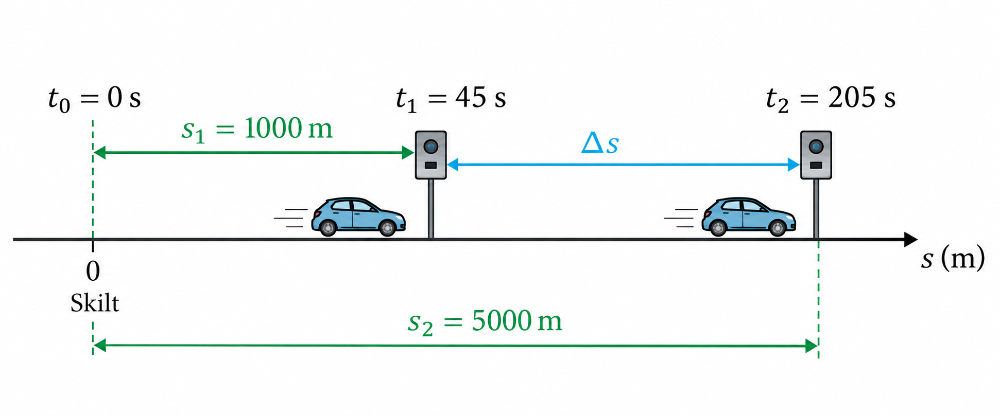
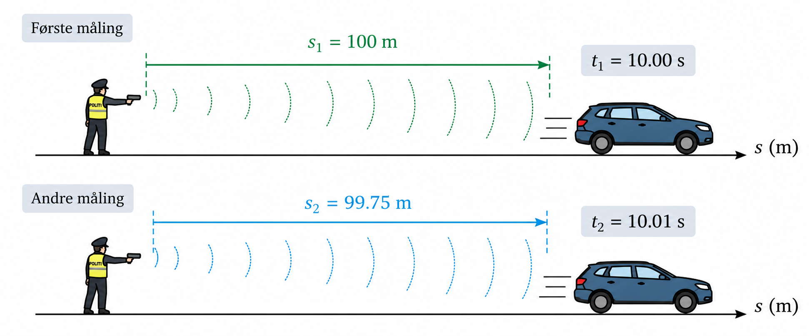

## Fra fartsmåling til numerisk derivasjon {.center}

::: {.eyebrow}
INGA1002 · Programmering, numerikk og sikkerhet
:::

Hvordan finner vi en hastighet vi ikke kan lese av direkte?

::: {.subtitle-line}
Jonas J. Harang · 16. september 2026  
Basert på undervisningsmateriale av Kai Erik Hoff og Truls Helge Øi.
:::

::: {.notes}
Før start: Åpne den utfylte Uke38_Numerisk_derivasjon_arrays.ipynb på Huben.
Test aktiviteten og ha lenken til reservefiguren klar. Ett bytte til Huben på siste slide.
Slicing og logspace er ikke med. Truls tar feil mot h og mulig falleksperiment fredag.
:::

## Hva måler fotoboksen?

::: {.columns}
::: {.column width="66%"}
{fig-alt="Skilt for strekningsmåling på vei med fartsgrense 80 km/t" width=100%}
:::
::: {.column width="34%"}
To fotobokser.  
En kjent veistrekning.  
To tidspunkt.

::: {.fragment .question}
Vet vi hvor fort bilen kjørte akkurat midt mellom boksene?
:::
:::
:::

::: {.notes}
La studentene svare før neste slide. Skiltet viser at strekningsmålingen går
fra kilometer 1 til kilometer 5; det er 4 km mellom målepunktene.
:::

## Fra 1 km til 5 km

{fig-alt="Bil som passerer fotobokser ved 1000 og 5000 meter" height=220 fig-align="center"}

::: {.columns}
::: {.column width="50%"}
::: {.fragment .math-step}
$$\Delta s=s_2-s_1=5000-1000=4000\ \mathrm{m}$$
:::
:::
::: {.column width="50%"}
::: {.fragment .math-step}
$$\Delta t=t_2-t_1=205-45=160\ \mathrm{s}$$
:::
:::
:::

::: {.fragment .math-step}
$$v_{\text{snitt}}=\frac{\Delta s}{\Delta t}
=\frac{4000}{160}=25\ \mathrm{m/s}=90\ \mathrm{km/t}$$
:::

::: {.fragment .callout-box .compact-box}
Gjennomsnittsfarten er over fartsgrensen: **bot**. Målingen forteller likevel
ikke om bilen holdt samme fart hele veien.
:::

::: {.notes}
Startpunktet ved skiltet er s₀=0 m og t₀=0 s. Første fotoboks passeres ved
s₁=1000 m, t₁=45 s; den andre ved s₂=5000 m, t₂=205 s. Legg vekt på at
vi trekker målepunktene fra hverandre. Spør om bilen kan ha kjørt både saktere
og fortere enn 90 km/t underveis. Ja: Vi kjenner bare gjennomsnittet.
:::

## Hva med farten akkurat nå?

::: {.columns}
::: {.column width="57%"}
{fig-alt="Politibetjent som bruker en håndholdt fartsmåler" width=100%}
:::
::: {.column width="43%"}
Speedometeret viser farten **nå**.

Hvordan kan vi anslå den fra posisjonsmålinger?
:::
:::

::: {.notes}
Bildet viser en håndholdt fartsmåler. Vi går videre med en idealisert
laserbasert måling der avstanden måles to ganger svært raskt.
:::

## To raske avstandsmålinger

{fig-alt="To laserbaserte avstandsmålinger av en bil som nærmer seg" height=260 fig-align="center"}

::: {.columns .laser-values}
::: {.column width="50%"}
::: {.fragment .math-step}
$$\Delta s=s_2-s_1=99{,}75-100{,}00=-0{,}25\ \mathrm{m}$$
:::
:::
::: {.column width="50%"}
::: {.fragment .math-step}
$$\Delta t=t_2-t_1=10{,}01-10{,}00=0{,}01\ \mathrm{s}$$
:::
:::
:::

::: {.fragment .math-step}
$$\frac{\Delta s}{\Delta t}=-25\ \mathrm{m/s}$$
:::

::: {.fragment .callout-box .compact-box}
Minustegnet betyr at avstanden minker. Bilens **fart** er $25\ \mathrm{m/s}=90\ \mathrm{km/t}$.
:::

::: {.notes}
Dette er en idealisert utregning. s er her avstanden fra betjenten, ikke bilens
posisjon i kjøreretningen. Derfor blir endringsraten negativ når bilen nærmer seg.
Dette bygger opp til «Um, actually»: radar og laser er forskjellige måleprinsipper.
:::

## Um, actually …

::: {.columns}
::: {.column width="48%"}
{fig-alt="Um, Actually: invitasjon til å korrigere foreleseren" height=400}
:::
::: {.column width="52%"}
::: {.fragment}
En **radar** bruker Doppler-effekten.
:::

::: {.fragment}
En **laserbasert fartsmåler** kan bruke gjentatte avstandsmålinger.
:::

::: {.fragment .callout-box}
Vårt spørsmål: Hvordan beregner vi hastighet når vi har **posisjon og tid**?
:::
:::
:::

::: {.notes}
Kort presisering, ikke en forelesning om måleteknikk. Gå videre til modellen vår:
rettlinjet bevegelse, positiv retning og posisjonsfunksjonen s(t).
:::

## En posisjonsgraf er ikke et bilde av veien

::: {.columns}
::: {.column width="52%"}
- Bilen beveger seg langs en rett vei.
- Den vannrette grafaksen viser **tid**.
- Den loddrette grafaksen viser **posisjon**.
:::
::: {.column width="48%"}
::: {.fragment}
$$v_{\text{snitt}}=
\frac{s(t_2)-s(t_1)}{t_2-t_1}
=\frac{\Delta s}{\Delta t}$$
:::

::: {.fragment .callout-box}
Hastigheten er **stigningen** i posisjonsgrafen, ikke høyden på grafen.
:::
:::
:::

::: {.small}
Vi lar bilen kjøre i positiv retning, slik at fart og hastighetens tallverdi er like.
:::

## To målepunkter → én sekant {.demo-slide}

<iframe class="demo" data-external="1" src="../../aktiviteter/numerisk-derivasjon/index.html?embed=1" title="Interaktiv posisjonsgraf med forover-, bakover- og senterdifferanse" loading="eager"></iframe>

::: {.small}
[Åpne aktiviteten i eget vindu](../../aktiviteter/numerisk-derivasjon/index.html){target="_blank"} · [Statisk reservefigur](../../aktiviteter/numerisk-derivasjon/sekant-tangent.svg){target="_blank"}
:::

::: {.notes}
1. Start med 5t², t=1 og h=0,2. Spill bevegelsen og spør hvordan graf og bil henger sammen.
2. Nullstill. Skjul tangent, la studentene anslå momentan hastighet.
3. Vis tangent. Reduser h mens t holdes fast.
4. Bytt forover/bakover/senter. Merk at senter bruker intervallet 2h.
5. Bytt til t³: senter er nå bare tilnærmet.
Hvis iframe ikke virker: åpne lenken. Hvis JS ikke virker: bruk reservefiguren.
:::

## Fra gjennomsnitt til momentan hastighet

::: {.fragment}
Kortere tidsintervall gir informasjon nærmere tidspunktet vi undersøker.
:::

::: {.fragment}
$$s'(t)=\lim_{h\to 0}\frac{s(t+h)-s(t)}{h}$$
:::

::: {.fragment .callout-box}
På datamaskinen bruker vi en **endelig skrittlengde** $h>0$.
Vi beregner en tilnærming til den deriverte.
:::

::: {.fragment .callout-box .why-box}
**Hvorfor numerisk derivering?** Når vi bare har måledata eller beregnede
funksjonsverdier, har vi ikke nødvendigvis en formel vi kan derivere. Da anslår
vi den momentane endringsraten fra små endringer i funksjonsverdiene.
:::

::: {.notes}
Ikke sett h=0. Vi skal senere se at svært liten h heller ikke alltid er best.
:::

## Tre måter å velge nabopunkter på

| Metode | Punkter | Tilnærming til $s'(t)$ |
|---|---|---|
| Forover | $t,\ t+h$ | $\displaystyle\frac{s(t+h)-s(t)}{h}$ |
| Bakover | $t-h,\ t$ | $\displaystyle\frac{s(t)-s(t-h)}{h}$ |
| Senter | $t-h,\ t+h$ | $\displaystyle\frac{s(t+h)-s(t-h)}{2h}$ |

::: {.fragment .question}
Hvorfor står det $2h$ i den siste nevneren?
:::

::: {.notes}
Vent på svar: punktene ligger h på hver side av t. Formlene gjelder også f(x),
uavhengig av om variabelen er tid eller noe annet.
:::

## Regneeksempel 1: en bil akselererer

Posisjonen er $s(t)=5t^2$, med $t$ i sekunder og $s$ i meter.

Finn hastigheten ved $t=1\ \mathrm{s}$, med $h=0{,}2\ \mathrm{s}$.

::: {.fragment}
$$
\begin{aligned}
s(0{,}8)&=5\cdot 0{,}8^2=3{,}2\\
s(1)&=5\\
s(1{,}2)&=5\cdot 1{,}2^2=7{,}2
\end{aligned}
$$
:::

::: {.fragment}
Eksakt: $s'(t)=10t$, altså $s'(1)=10\ \mathrm{m/s}$.
:::

::: {.notes}
La studentene først regne de tre posisjonene. Ved bevegelsesmodellen har
koeffisienten 5 enheten m/s². Forutsett at modellen gjelder gjennom intervallet.
:::

## Forover og bakover

::: {.given-values}
$s(0{,}8)=3{,}2\ \mathrm{m},\qquad s(1)=5\ \mathrm{m},\qquad s(1{,}2)=7{,}2\ \mathrm{m}$
:::

::: {.columns}
::: {.column width="50%"}
### Forover

$\displaystyle\frac{s(1{,}2)-s(1)}{0{,}2}$

::: {.fragment .math-step}
$\displaystyle=\frac{7{,}2-5}{0{,}2}$
:::

::: {.fragment .math-step}
$=11\ \mathrm{m/s}$
:::
:::
::: {.column width="50%"}
### Bakover

$\displaystyle\frac{s(1)-s(0{,}8)}{0{,}2}$

::: {.fragment .math-step}
$\displaystyle=\frac{5-3{,}2}{0{,}2}$
:::

::: {.fragment .math-step}
$=9\ \mathrm{m/s}$
:::
:::
:::

::: {.fragment .question}
Hvorfor ligger svarene på hver sin side av $10\ \mathrm{m/s}$?
:::

::: {.notes}
Bevegelsen akselererer. Forover bruker intervallet etter t, bakover intervallet før.
Unngå å generalisere «forover gir alltid for høyt» til alle funksjoner.
:::

## Senterdifferanse

::: {.given-values}
$s(0{,}8)=3{,}2\ \mathrm{m},\qquad s(1)=5\ \mathrm{m},\qquad s(1{,}2)=7{,}2\ \mathrm{m}$
:::

$\displaystyle s'(1)\approx\frac{s(1+0{,}2)-s(1-0{,}2)}{2\cdot0{,}2}$

::: {.fragment .math-step}
$\displaystyle=\frac{7{,}2-3{,}2}{0{,}4}$
:::

::: {.fragment .math-step}
$=10\ \mathrm{m/s}$
:::

::: {.fragment .callout-box}
Her blir svaret eksakt. Det er en egenskap ved andregradsfunksjoner.
:::

::: {.notes}
Alle tre er metoder for tilnærming. Ikke la dette eksempelet etablere
en forventning om at senterdifferansen alltid er eksakt.
:::

## Regneeksempel 2: er senter alltid eksakt?

La $f(x)=x^3$. Vi bruker $x=1$ og $h=0{,}2$.

::: {.fragment}
$f(0{,}8)=0{,}512,\quad f(1)=1,\quad f(1{,}2)=1{,}728$.
:::

::: {.fragment .math-step}
$\displaystyle D_+f(1)=\frac{1{,}728-1}{0{,}2}=3{,}64$
:::

::: {.fragment .math-step}
$\displaystyle D_-f(1)=\frac{1-0{,}512}{0{,}2}=2{,}44$
:::

::: {.fragment .math-step}
$\displaystyle D_0f(1)=\frac{1{,}728-0{,}512}{0{,}4}=3{,}04$
:::

::: {.fragment}
Eksakt: $f'(1)=3$. Senterdifferansen er nærmest, men har feil $0{,}04$.
:::

::: {.notes}
Dette er eksamensrelevant innsetting i formler. La dem regne minst senter selv,
og vis deretter trinnene. D+, D− og D0 er bare korte navn på de tre metodene.
:::

## Hva skjer hvis vi halverer h?

Samme funksjon $f(x)=x^3$, samme punkt $x=1$.

| $h$ | Forover | Bakover | Senter |
|---|---:|---:|---:|
| $0{,}2$ | $3{,}64$ | $2{,}44$ | $3{,}04$ |
| $0{,}1$ | $3{,}31$ | $2{,}71$ | $3{,}01$ |

::: {.fragment}
Senterfeilen gikk fra $0{,}04$ til $0{,}01$: en fjerdedel.
:::

::: {.fragment .question}
Hvordan undersøker vi dette for mange verdier uten å regne alt for hånd?
:::

::: {.notes}
Teaser til fredag: feil som funksjon av h. Ingen logspace eller loglog her.
:::

## Nå tar vi med oss problemet inn i Python {.center}

::: {.callout-box}
**Ett tall → mange tall → en figur vi kan tolke.**
:::

Åpne **Uke38_Numerisk_derivasjon_arrays.ipynb** i JupyterHub.

Vi fortsetter fra **«Her starter programmeringsdelen»**.

::: {.small}
[Last ned den ferdig utfylte notebooken](Uke38_Numerisk_derivasjon_arrays.ipynb) ·
[Åpne JupyterHub](https://inga1002.jupyter.ntnu.no/){target="_blank"}
:::

::: {.notes}
Her bytter vi én gang til Huben og blir der resten av forelesningen.
Notebooken har en kort oppsummering av slides først. Ikke gjennomgå den igjen.
Den publiserte nedlastingsfilen er en utfylt variant. Distribusjon via main/nbgitpuller
avgjøres senere; denne presentasjonen endrer ikke studentenes eksisterende filer.
:::
